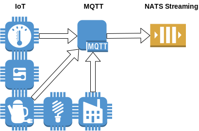

#  IoT, CEP, storage and NATS in between. Part I.

## Intro

Hello, my name is Dmitry Dorofeev, I’m a software architect working for Luxms Inc. We are a small team of the creative programmers touching technology which moves faster than we can imagine these days. This blog post is about building small streaming analytics pipeline which is minimalistic but can be grown to the bigger project easily. It can be started on the notebook (Yes, I tried that) and quickly deployed to the cloud if the need arise.

Our pipeline starts in the fields, ok, electromagnetic fields of the IoT sensors. That complicated part is interfaced by the MQTT broker which is our handy source of the sensor data stream. We route the sensors stream to the persistent queue, which is served by NATS Streaming. Then we have plenty of choises what to do next. We can just count messages in the queue, we can send them to the stream processor for analytics, we can forward it to any database for long term storage. But most important thing is that we can do it as many times as we want. NATS Streaming persists the stream for us and can replay it as many times as we want! So let's start playing and replaying. 

## In the fields



Our IoT partner [Thingenix](https://www.thingenix.com/) kindly provided us with MQTT broker and that saved us from yet another technology digging around sensors, LoRaWAN specifications and binary protocols. MQTT is ISO and OASIS standard supported by big players like IBM, Amazon and Microsoft. And that means you can easily find open source MQTT library for any language ranging from C to Haskell.

## From the fields to the Commit Log

There are plenty of choises on the message storage these days. Most popular is probably [Apache Kafka](https://kafka.apache.org/) wich is functional and battle tested. Basically it is distributed commit log with similar but not identical functionality to traditional message queues like RabbitMQ or ZeroMQ. If you want an in-depth understanding on the subject, including technical notes on Exactly-Once semantics, I recommend to read articles from the [Brave New Geek blog](http://bravenewgeek.com/category/messaging/). That covers both [Kafka](https://kafka.apache.org/) and [NATS Streaming](https://nats.io/).

Please note that NATS and NATS Streaming are different things. NATS can be described as fast pub/sub implementation. NATS Streaming is technically a message persistence extension on top of vanilla NATS server. So subscription to the NATS Streaming subject is not the same as subscription to the vanilla NATS subject. It might sound confusing, but once you get everything installed there is no complications anymore.

Making choice is not always easy thing. Comparing Kafka vs NATS Streaming we finally selected NATS Streaming for this small project and adopting NATS Streaming in our product line. There are several reasons which are not necessarily applicable for your projects:

* NATS Streaming server is a single executable binary which might be even statically compiled. It is very suitable for Docker/Cloud deployements.
* NATS Streaming server performs lightning fast even though it is younger project comparing to Kafka.
* NATS Streaming has simple uncluttered configuration.
* NATS Streaming has enough features for most our usecases.
* NATS Community is very friendly with help and very open with all sort of discussions. 
* MIT License (Kafka is Apache 2 licensed).
* Small codebase. NATS github archive is around 400Kb. Kafka is more than 7Mb.

On the Mac you can install NATS Streaming with `brew install nats-streaming-server`. Then we need to specify file storage for our messages and some limits in the config file as shown below:

```
# Use file for message store
store: file
dir: "/home/dmitry.dorofeev/NATS"
file: {
     compact_enabled: true
     compact_frag: 50
     compact_interval: 3000
     crc: true
     sync: true
     parallel_recovery: 1
     buffer_size: 2MB
     slice_max_bytes: 500MB
}

# HTTP monitoring port
http_port: 8222 

# Define store limits.
# Can be limits, store_limits or StoreLimits.
store_limits: {
    # Define maximum number of channels.
    # Can be mc, max_channels or MaxChannels
    max_channels: 100

    # Define maximum number of subscriptions per channel.
    # Can be msu, max_sybs, max_subscriptions or MaxSubscriptions
    max_subs: 100

    # Define maximum number of messages per channel.
    # Can be mm, max_msgs, MaxMsgs, max_count or MaxCount
    max_msgs: 100000000

    # Define total size of messages per channel.
    # Can be mb, max_bytes or MaxBytes. Expressed in bytes
    max_bytes: 5GB

    # Define how long messages can stay in the log, expressed
    # as a duration, for example: "24h" or "1h15m", etc...
    # Can be ma, max_age, MaxAge.
    max_age: "0"
}

# Enable debug log
stan_debug: true
```

Basically we limit number of messages `max_msgs` to 100 millions and total size of all messages `max_bytes` to 5 Gigabytes. If we overfill our NATS Streaming server with messages it will automatically delete oldest messages trying to keep limits. 

Each channel keeps messages in the separate directory named with the channel name. Messages can be split between several files named slices for numerous optimisations. We limited slice size `slice_max_bytes` to 500Mb. With this setup we will have maximum of 10 slices for messages if all of them will be in the single channel and occupy 5Gb in total.

Almost all configuration options may be specified from the command line as well. Please check documentation on [github](https://github.com/nats-io/nats-streaming-server#configuring). It have full description for all available parameters, details how to mix vanilla NATS and NATS Streaming configs, authorization and security settings and how to specify per server or per channel limits.

Once you have your config file ready you can start the server with the command `nats-streaming-server --config=/home/user/NATS/nats.conf`, providing full path to the config file. 

At this point we have both MQTT and NATS Streaming servers running, but no message is flowing from one to the another. That should be programmed and we can use C#, Go, Java, Node.js or Ruby to write NATS Streaming clients. These languages are officially supported by the Apcera Inc. while Python and Arduino support is provided by the community. 

We choosed Javascript as it seems to be a lingua franca for modern computing. The only drawback using Javascript is its single thread async nature. Fortunately, Javascript provide some handy constructs to deal with this complication and we used `Promise` to make async code more pleasant to deal with.

```Javascript
var mqtt = require('mqtt');
var natsNodeStreaming = require('node-nats-streaming');
var colors = require('colors');

// 1. Connect to MQTT Server using SSL, login and password
function createMqttConnection() {
  return new Promise((resolve, reject) => {
    var mqttConnection  = mqtt.connect('mqtts://nowhere.mqtt.io', {
      username: 'mqtt_username',
      password: 'give me messages',
    });
// 2. Print debug message on successfull MQTT connection 
    mqttConnection.on('connect', () => {
      console.log('MQTT - connected');
      resolve(mqttConnection);
    });

  });
}

// 3. Connect to NATS Streaming on localhost. Cluster name is test-cluster (default)
//    our client name is thingenix-mqtt-proxy (should be unique on the server)
function createNatsConnection() {
  return new Promise((resolve, reject) => {
    var server = natsNodeStreaming.connect('test-cluster', 'thingenix-mqtt-proxy');
    server.on('connect', function () {
// 4. Print debug message on successfull NATS Streaming connection 
      console.log('NATS - connected');
      resolve(server);
    });
  });
}

// main
Promise.all([createMqttConnection(), createNatsConnection()])
.then(([mqttConnection, natsConnection]) => {
  console.log('Connected to MQTT & NATS');

  mqttConnection.on('message', (topic, message) => {
    // message is Buffer
    console.log(topic.toString().underline.blue, message.toString());
// 5. On every message received from MQTT broker publish it to the NATS Streaming subject
//    named thingenix
    natsConnection.publish('thingenix', message.toString(), (err, guid) => {
      if(err) {
        console.log('publish failed: '.red, err);
      } else {
        console.log('published message with guid: '.green + guid);
      }
    });
  });

// 6. Subscribe to the 4 MQTT topics, actually here is 4 wildcards for potentially
//    hundreds of topics.  
  mqttConnection.subscribe('592c8451da64856b397fcdfe/#');  // Industrial
  mqttConnection.subscribe('594e7bfb463aee1301da2d6b/#');  // Oil & Gas
  mqttConnection.subscribe('594e7c0a463aee1301da2d6d/#');  // Agriculture
  mqttConnection.subscribe('594e7c1b463aee1301da2d6f/#');  // Solar
})
.catch((err) => {
  console.log(err);
});  
```

You can see that NATS Streaming code is not much different from the MQTT code. So if you have experience with programming MQ or pub/sub systems you should be able to program NATS without overwhelming learning curve.

Please check github project [mqtt2nats](https://github.com/luxms/streaming-analytics-demo/tree/master/mqtt2nats) for full source code and installation instructions.

## Stream processors

Now we have our messages ready for replay, but what we can do with it? We can program custom logic calculating various averages, sending alerts and do smart logging. But wait, this code can quickly become a mess. The main reason for it is that requirements for stream processing will quickly change and grow. Every result or functionality gathered from the data stream will often be a starting point for couple of next things to check, calculate or compare. And finally, after several iterations the [Big ball of mud](https://en.wikipedia.org/wiki/Big_ball_of_mud) might arrive.

Fortunately, there are several stream processors readily available to help us doing stream processing and keep things organised and well structured. The most popular processor is probably [Apache Spark](https://spark.apache.org/) based on micro-batches, but [Apache Flink](https://flink.apache.org/) is truly stream based and still did not get as much adoption as Spark. And there is [Apache Beam](https://beam.apache.org/) on top of these two powerfull open source technology leaders.  

Ok, we come close to [the Paradox of choice](https://en.wikipedia.org/wiki/The_Paradox_of_Choice) quite qucikly and I even didn't mention [Apache Apex](http://apex.apache.org/) yet?

To solve the Paradox of choice I deny mainstream and will try very interesting piece of tech named [Riemann](http://riemann.io/). If NATS Streaming was selected instead of mainstream Kafka, then Riemann would be a good match. Riemann may look simple comparing with Spark, but simplicity not alayws a bad thing. And quite frankly, I can not resist to touch some ancient technology (some people believe that it is alien technology) named LISP, which ressurected as [Clojure](https://clojure.org/). Riemann implemented in Clojure and if you don't afraid programmable substrate with its homoiconity, s-expressions and brackets, keep reading!


## NATS and Riemann

We will use Reamann in 2 modes: debug and production. In debug mode we will replay events from NATS Streaming to gather some understanding about the data and then we will configure production setup for non-stop operation on events stream.

While Reamann has built-in Kafka support, there is no NATS Streaming support yet. As a first step to fix it, I started a [clj-nats-streaming](https://github.com/deem0n/clj-nats-streaming) wrapper on github but definitely need help form the expirienced Clojure programmers.

For now we will use JavaScript to replay streams from NATS Streaming to Riemann. The source code is available on github, check the folder [nats2reamann](https://github.com/luxms/streaming-analytics-demo/tree/master/nats2riemann).

The code is nothing special, we just read all messages from NATS Streaming one by one, skip ones without timestamp and publish one event for every message metric into Riemann. 

```javascript
Promise.all([createRiemannConnection(), createNatsConnection()])
.then(([riemannConnection, natsConnection]) => {
  console.log('Connected to Riemann & NATS');

  var opts = natsConnection.subscriptionOptions().setDeliverAllAvailable();
  var natsSubscription = natsConnection.subscribe('thingenix', opts);

  var i = 0;
  natsSubscription.on('message', (msg) => {
    // message is Buffer
    if (i++ % 50000 == 0) {
      console.log("Got from Nats".underline.blue, i, "messages".underline.blue);
      console.log(msg.getData());
    }

    var message = JSON.parse(msg.getData());
    for (a in message["items"]) {
      if ( message["timestamp"] === undefined ) {
         continue;
      }
      var d = new Date(message["timestamp"]);
      riemannConnection.send(riemannConnection.Event({
          host: message["_id"],
          service: a,
          time: d.getTime() / 1000,
          metric: message["items"][a],
          attributes: [{key:"longitude", value: message["loc"][0]}, {key:"latitude", value: message["loc"][1]},{key:"context", value: message["context"]}], //custom fields
          //tags: ['nonblocking']
          ttl: 100000
        }), riemannConnection.tcp);
    }
  });
})
.catch((err) => {
  console.log(err);
});
```

```
(defn moving-average [num-seconds & children]
  (moving-event-window num-seconds (apply smap folds/mean children)))
```


TODO: call for help with Clojure coding.

TODO: discuss script in node.js to send messages from NATS Streaming to Riemann

TODO: discuss Riemann stream processing a bit

## NATS to Cassandra

TODO: example script in Golang to store messages from NATS to Cassandra table

## NATS to Greenplum

TODO: example script to store messages from NATS to Greenplum/Postgres table

## One picture is better than thousand words

TODO: show some visualisatons from Luxms BI